# ml-service
 
 docker-compose up

________

Use Case Diagram
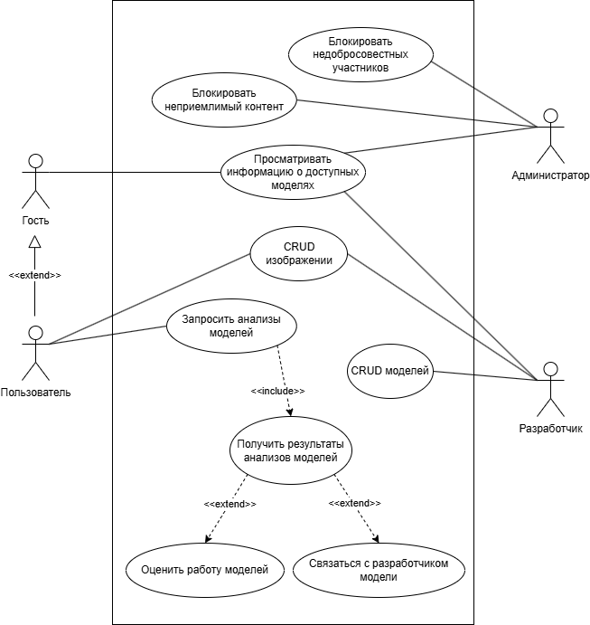

________

Component Diagram
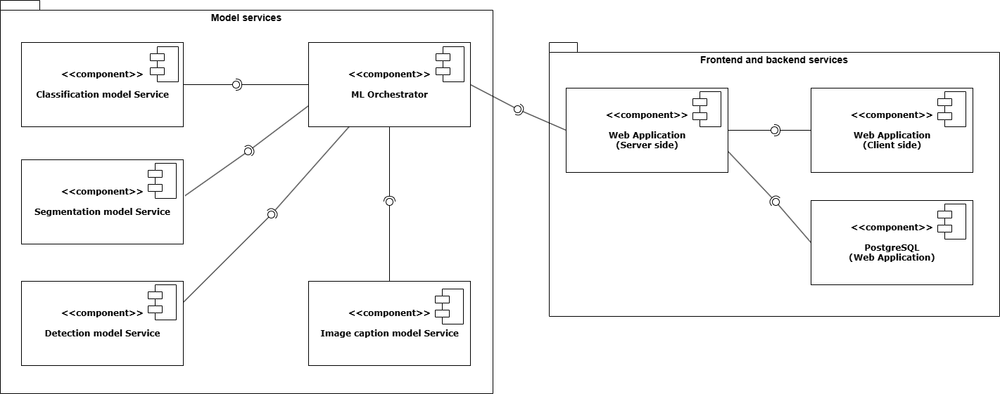

________

Sequence Diagram
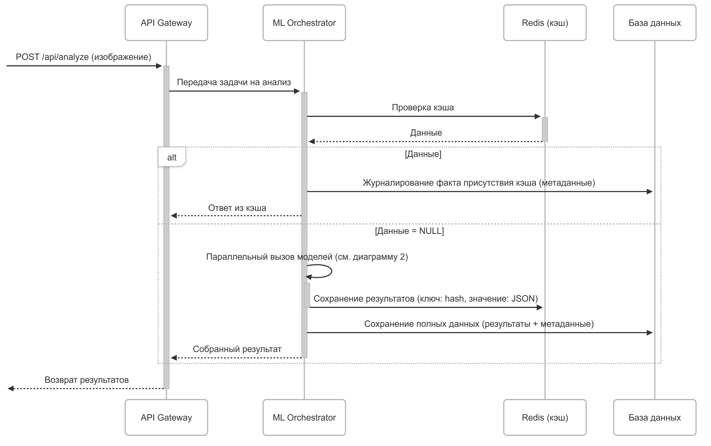

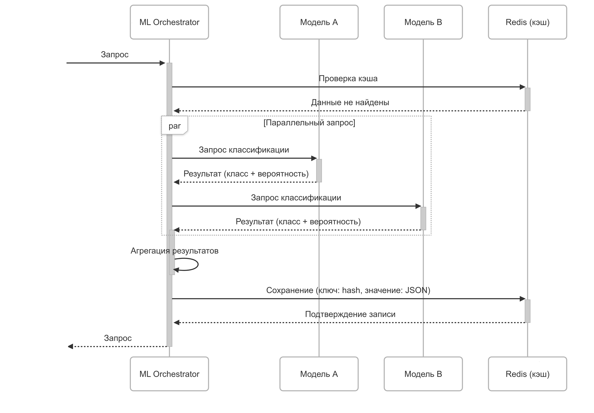

________

Deployment Diagram
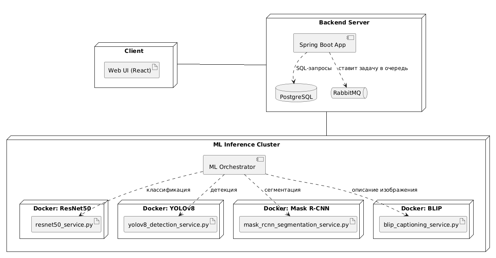

________

Package Diagram Server
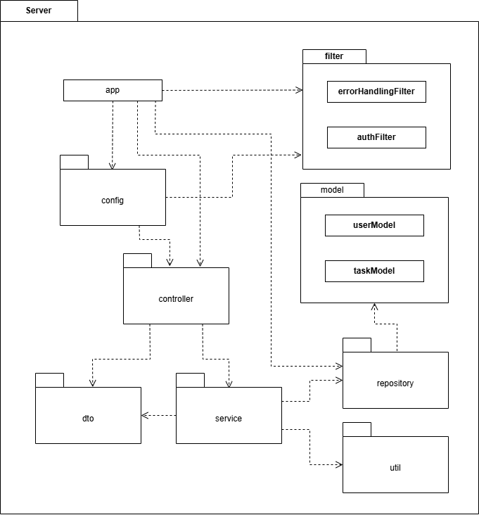

________

Package Diagram ML Orchestrator
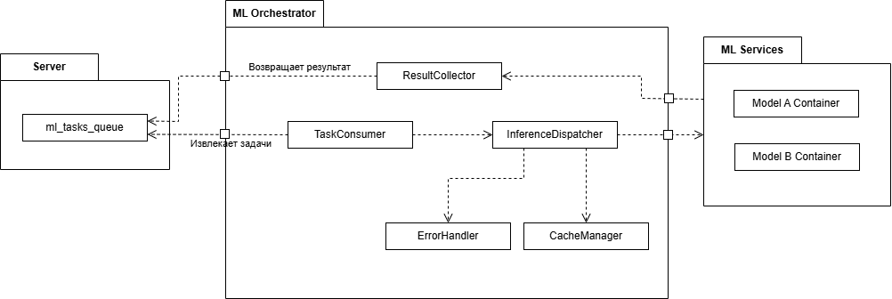

________

Database scheme
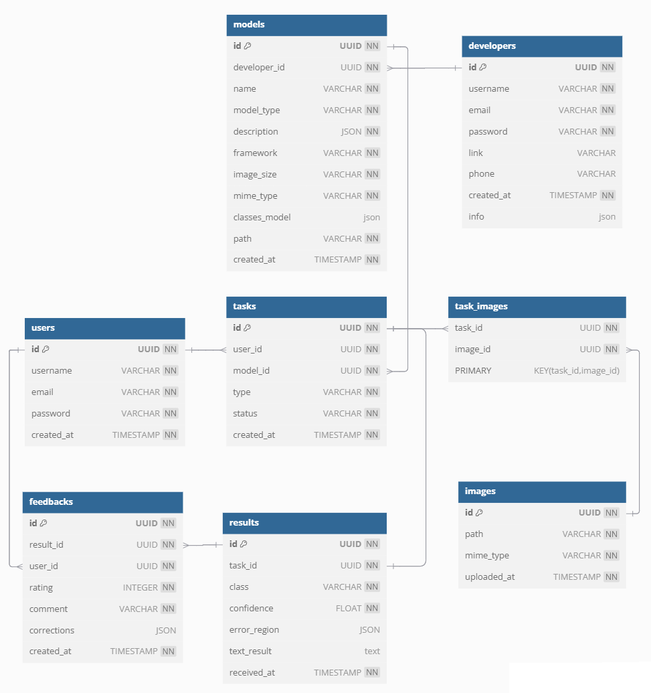

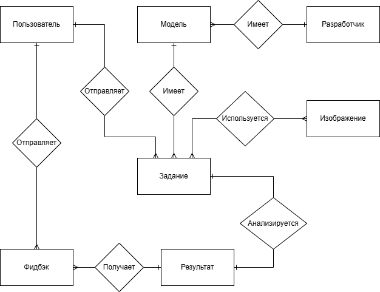

________

Service
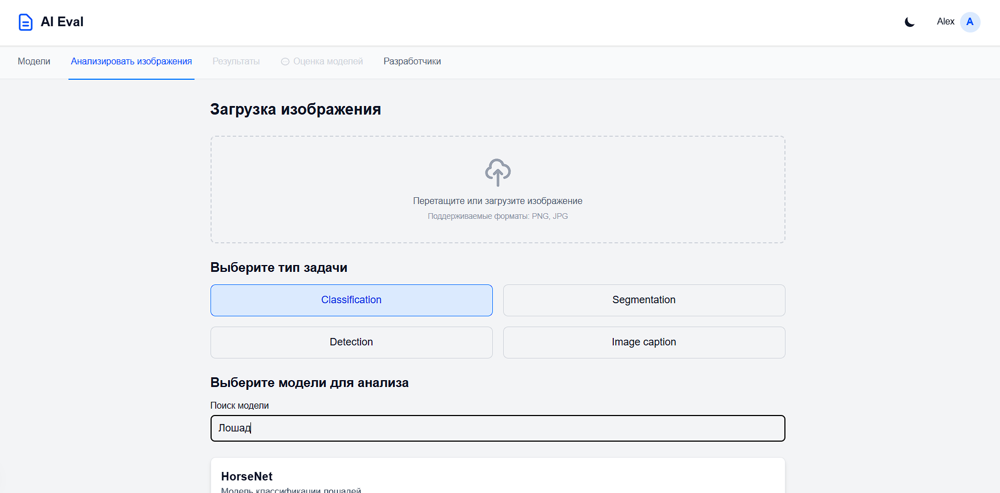

________

Service
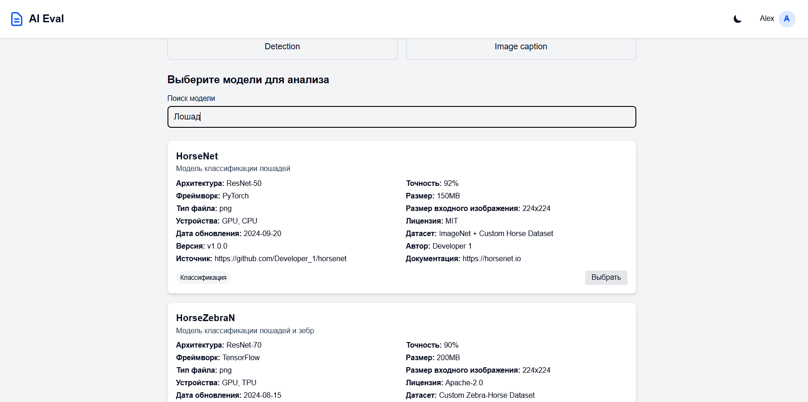

________

Service
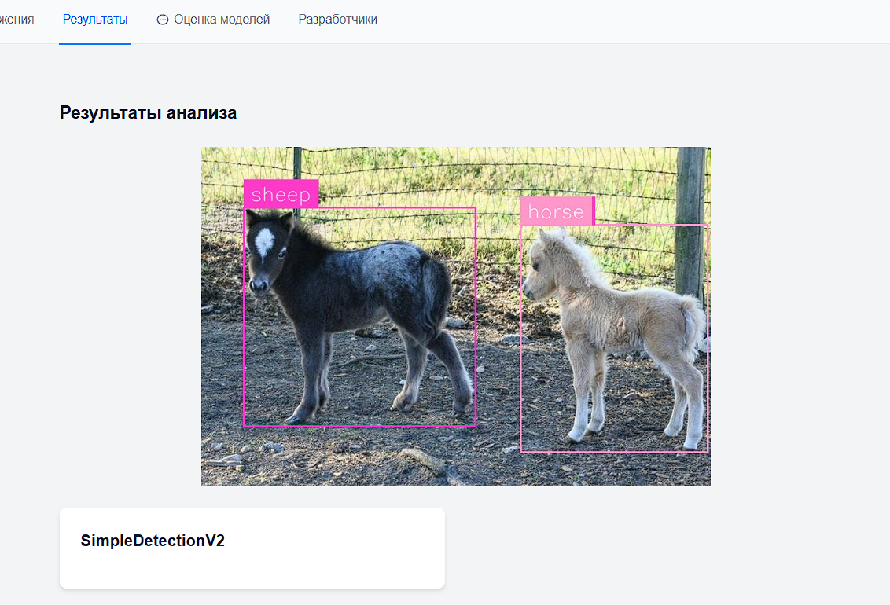

________

Service
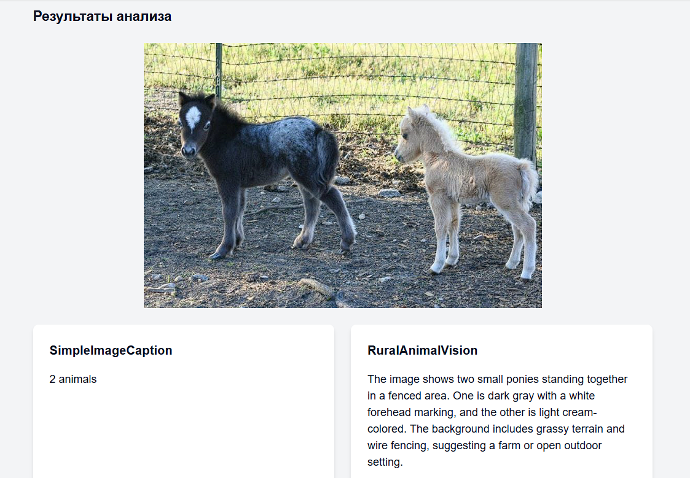

________

Service
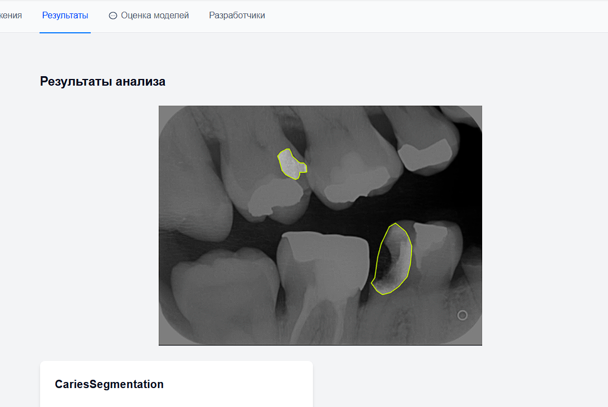

________

Service
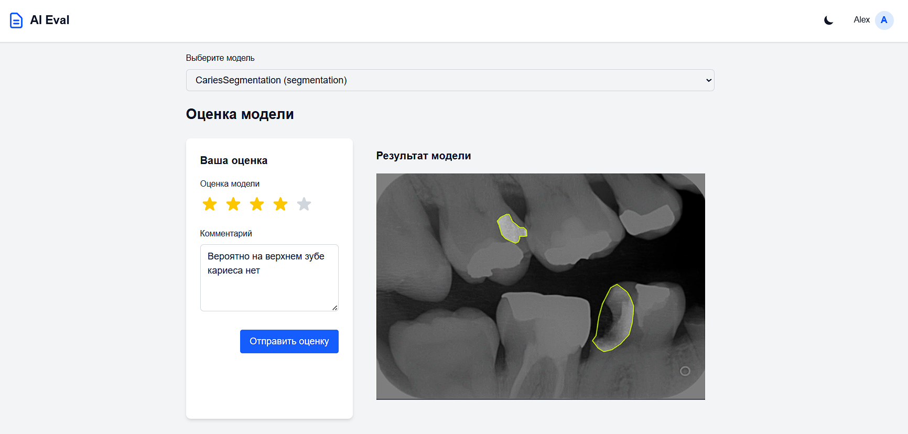

________

Service
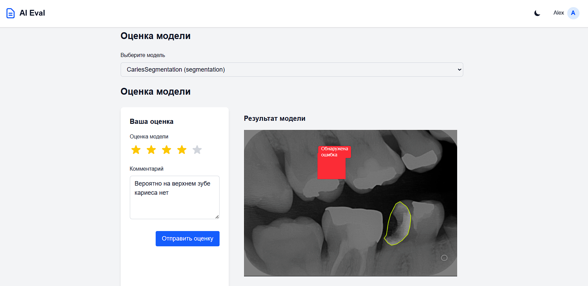

________

Service
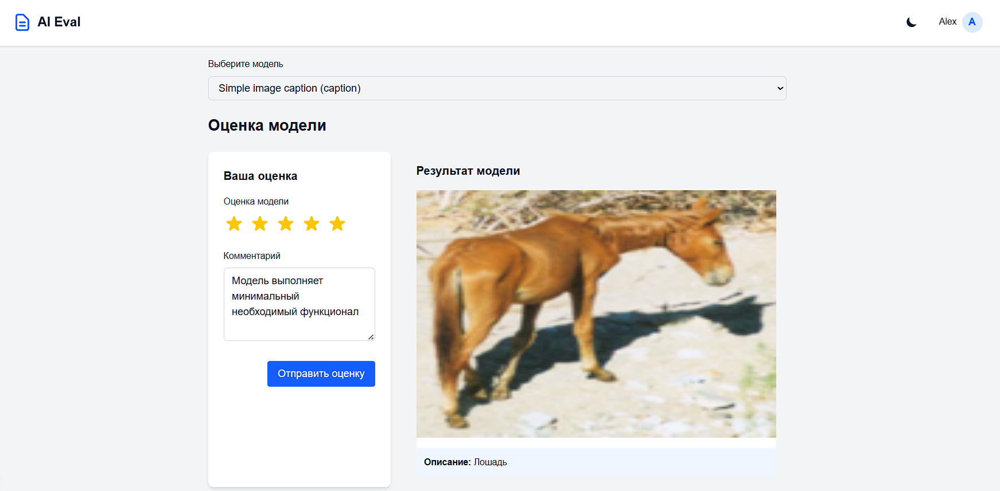

________

Service
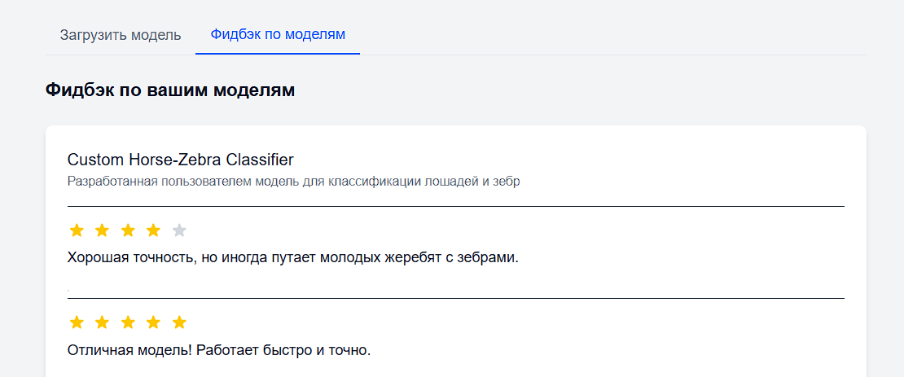